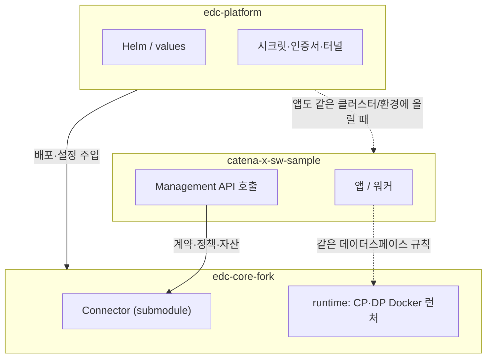
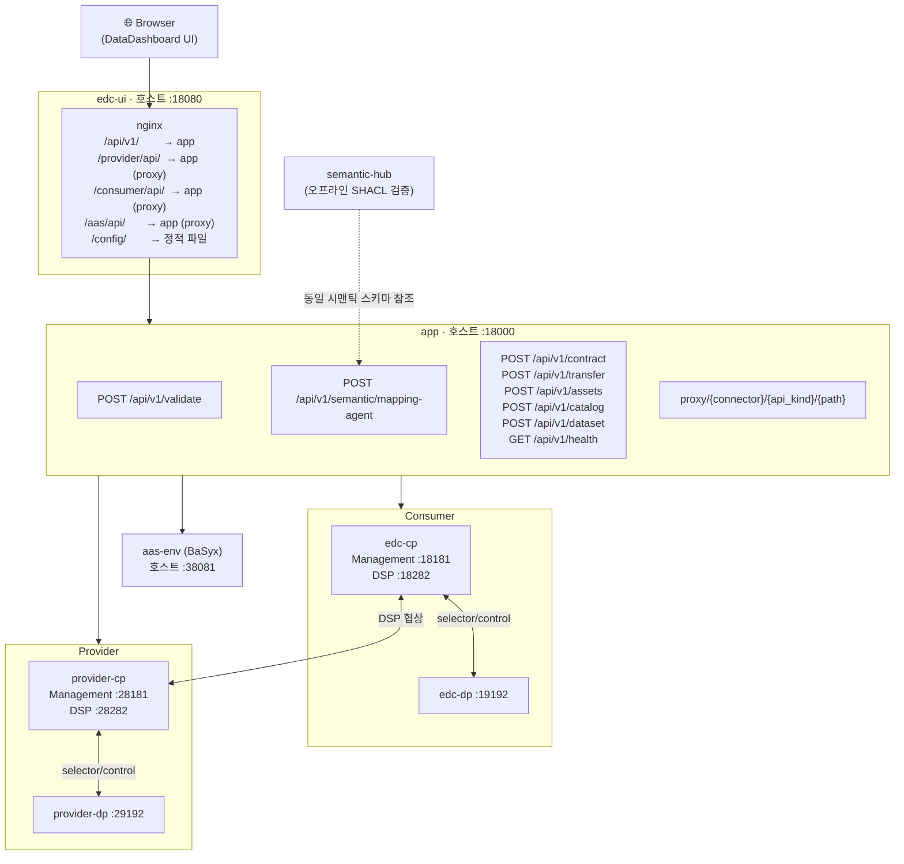
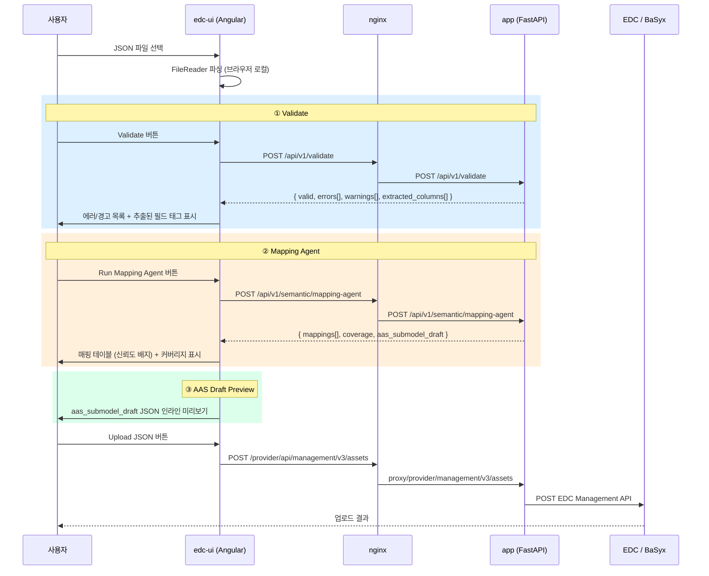

# m-x-dataspace

**데이터 스페이스(EDC 기반)** 를 **앱 · 커넥터 · 플랫폼** 세 덩어리로 나눠 책임을 분리한 모노레포입니다.  
각 폴더는 서로 다른 속도로 바뀌고, 다른 팀이 만져도 되도록 경계를 둔 것이 목적입니다.

---

## 세 폴더가 하는 일

| 폴더 | 역할 (한 줄) |
|------|----------------|
| **`catena-x-sw-sample`** | 비즈니스 앱, EDC Management 연동, Outbox/Worker, 단위·E2E 테스트의 **진입점** |
| **`edc-core-fork`** | CP/DP 런타임, 정책·프로토콜 확장. `Connector`는 **공식 EDC submodule**, `runtime/`은 **Docker로 올릴 최소 런처** |
| **`edc-platform`** | Helm values, 시크릿·인증서, 터널, 로그/메트릭 등 **운영·배포** 설정 |

---

## 폴더 간 관계 (누가 누구를 쓰나)



**읽는 법:** 앱은 주로 **커넥터(EDC)** 와 말을 주고받고, 플랫폼은 **커넥터와 앱을 같은 방식으로** 감싸 줍니다(Helm·시크릿·네트워크).

---

## 전체 서비스 아키텍처 (로컬 docker compose 기준)



---

## 서비스별 포트 요약

> 출처: [`docker-compose.yml`](docker-compose.yml)

| 서비스 | 호스트 포트 | 컨테이너 포트 | 용도 |
|--------|------------|--------------|------|
| `edc-ui` | **18080** | 8080 | DataDashboard UI (nginx) |
| `app` | **18000** | 8000 | FastAPI 백엔드 / 프록시 |
| `aas-env` | **38081** | 8081 | BaSyx AAS Environment |
| `edc-cp` | 19191 | 19191 | Consumer CP 공개 API |
| `edc-cp` | 19199 | 9191 | Consumer CP Control |
| `edc-cp` | **18181** | 8181 | Consumer CP Management (UI 연동) |
| `edc-cp` | 18282 | 8282 | Consumer CP DSP Protocol |
| `edc-dp` | 19192 | 19192 | Consumer DP 공개 API |
| `edc-dp` | 19299 | 9192 | Consumer DP Control |
| `provider-cp` | 29191 | 19191 | Provider CP 공개 API |
| `provider-cp` | 29199 | 9191 | Provider CP Control |
| `provider-cp` | **28181** | 8181 | Provider CP Management (UI 연동) |
| `provider-cp` | 28282 | 8282 | Provider CP DSP Protocol |
| `provider-dp` | 29192 | 19192 | Provider DP 공개 API |
| `provider-dp` | 29299 | 9192 | Provider DP Control |

---

## 빠른 시작

1. **Python 테스트**  
   `python -m pytest catena-x-sw-sample/tests -q`

2. **EDC 컨테이너 스모크 (Windows PowerShell)**  
   `powershell -NoProfile -ExecutionPolicy Bypass -File scripts/verify.ps1`

3. **수동으로만 올리기**  
   `docker compose up --build`

4. **FastAPI 실행 (UI 연동용 백엔드)**  
   `cd catena-x-sw-sample && uvicorn app.api:app --host 0.0.0.0 --port 8000`

   | 엔드포인트 | 설명 |
   |-----------|------|
   | `GET  /api/v1/health` | 헬스체크 |
   | `POST /api/v1/assets` | 정책+자산+계약정의 시드 |
   | `POST /api/v1/catalog` | Consumer → Provider 카탈로그 조회 |
   | `POST /api/v1/dataset` | 특정 자산 데이터셋(오퍼) 조회 |
   | `POST /api/v1/contract` | 시드 + 협상 (`contractAgreementId` 반환) |
   | `POST /api/v1/transfer` | `contractAgreementId`로 전송 + 상태 대기 |
   | `POST /api/v1/validate` | JSON 구조 검증 (provider-asset / aas-shell 타입별) |
   | `POST /api/v1/semantic/mapping-agent` | JSON/CSV 필드 → ETRI AIoT 시맨틱 매핑 + AAS 서브모델 초안 생성 |
   | `ANY  /proxy/{connector}/{api_kind}/{path}` | EDC/AAS 직접 프록시 |

   - 전체 API 스모크 검증: `powershell -NoProfile -ExecutionPolicy Bypass -File scripts/verify_api.ps1`

5. **공식/커뮤니티 EDC Dashboard UI 연동 (Docker)**

   ```bash
   docker compose --profile ui --profile app up -d --build \
     edc-cp edc-dp provider-cp provider-dp aas-env app edc-ui
   ```

   - UI 주소(본인 PC): `http://localhost:18080`
   - **같은 사내망에서 동료가 접속:** Docker를 띄운 PC의 **LAN IPv4**와 포트 **18080**을 쓰면 됩니다. 예: `http://192.168.x.x:18080`  
     - `docker-compose.yml`의 `edc-ui`는 `18080:8080` 으로 호스트에 노출되며, UI는 nginx 기준 **상대 경로**(`/api/v1` 등)로 호출하므로 브라우저 주소만 위와 같으면 동료 PC에서도 동일하게 동작합니다.  
     - 해당 PC **Windows 방화벽**에서 **TCP 18080 인바운드**를 허용해야 합니다.
   - **LAN IP 확인 (Windows):** PowerShell 또는 CMD에서 `ipconfig` 실행 → `이더넷` 또는 `무선 LAN 어댑터 Wi-Fi` 항목의 **IPv4 주소**를 사용합니다. (VPN 사용 시 어댑터가 여러 개일 수 있으니, 사내 LAN에 붙은 쪽을 고릅니다.)  
     PowerShell에서 IPv4만 정리해 보려면:

     ```powershell
     Get-NetIPAddress -AddressFamily IPv4 | Where-Object { $_.InterfaceAlias -notmatch 'Loopback' } | Format-Table InterfaceAlias, IPAddress
     ```
   - 데모 주소는 슬랙·메일·위키 등으로 따로 공유드릴테니 연락주세요
   - UI는 Eclipse EDC DataDashboard 오픈소스를 빌드해 사용 → [eclipse-edc/DataDashboard](https://github.com/eclipse-edc/DataDashboard)
   - UI E2E 체크리스트: [`docs/ui-e2e-checklist.md`](docs/ui-e2e-checklist.md)
   - AAS Environment(BaSyx) 직접 API(호스트): `http://127.0.0.1:38081`

---

## Nginx 라우팅 맵

> 출처: [`docker/ui/nginx.conf`](docker/ui/nginx.conf)

| URL 패턴 (브라우저 → nginx) | 프록시 대상 | 설명 |
|---------------------------|-----------|------|
| `/api/v1/*` | `app:8000/api/v1/*` | FastAPI 직접 호출 (validate, mapping-agent 등) |
| `/provider/api/management/*` | `app:8000/proxy/provider/management/*` | Provider CP Management |
| `/provider/api/protocol/*` | `app:8000/proxy/provider/protocol/*` | Provider DSP Protocol |
| `/provider/api/*` | `app:8000/proxy/provider/default/*` | Provider 기본 API |
| `/consumer/api/management/*` | `app:8000/proxy/consumer/management/*` | Consumer CP Management |
| `/consumer/api/protocol/*` | `app:8000/proxy/consumer/protocol/*` | Consumer DSP Protocol |
| `/consumer/api/*` | `app:8000/proxy/consumer/default/*` | Consumer 기본 API |
| `/aas/api/*` | `app:8000/proxy/aas/registry/*` | BaSyx AAS Environment |
| `/config/*` | 정적 파일 (no-cache) | UI 설정 JSON |

---

## Assets → JSON Upload 탭 (3단계 플로우)

`Assets` 메뉴 → `JSON Upload` 탭에서 아래 순서로 작업합니다.



**Mapping Agent 시맨틱 타겟 (ETRI AIoT v1)**

> 출처: [`catena-x-sw-sample/app/semantic_mapping.py`](catena-x-sw-sample/app/semantic_mapping.py)  
> 스키마: [`semantic-hub/profiles/etri-aiot/v1.ttl`](semantic-hub/profiles/etri-aiot/v1.ttl)

| Canonical Field | Target Path | Required |
|----------------|-------------|:--------:|
| `time` | `record.time` | ✓ |
| `operationId` | `record.operationId` | ✓ |
| `controlS` | `cuttingCondition.S` | ✓ |
| `controlF` | `cuttingCondition.F` | ✓ |
| `toolPosX` | `toolPosition.X` | ✓ |
| `toolPosY` | `toolPosition.Y` | ✓ |
| `toolPosZ` | `toolPosition.Z` | ✓ |
| `spindleCurrentU` | `spindleMotor.currentU` | ✓ |
| `spindleCurrentV` | `spindleMotor.currentV` | ✓ |
| `statusLabel` | `operationStatus.label` | ✓ |

매핑 신뢰도(confidence)는 토큰 Jaccard 유사도로 계산하며, 0–1 범위로 반환됩니다.  
UI에서 **≥80%** 는 녹색, **40–79%** 는 노랑, **<40%** 는 빨강 배지로 표시됩니다.

---

## UI 트러블슈팅 요약

- `Catalog request`에서 `504` 발생 시:
  - 원인: 프록시 경로에서 블로킹 I/O로 인한 요청 대기
  - 조치: `app/api.py` 프록시는 `asyncio.to_thread(...)` 기반으로 수정됨
  - 확인: `docker compose logs -f app edc-ui`
- `Assets` 생성 팝업에서 `Type` 드롭다운 미표시:
  - 원인: `GET /v3/dataplanes` 결과가 빈 배열(`[]`)
  - 조치: `docker compose restart edc-dp provider-dp`
- `HttpData-PUSH` 전송이 `TERMINATED`:
  - 원인: sink를 읽기 endpoint(`https://httpbin.org/get`, `GET`)로 지정
  - 권장: `baseUrl=https://httpbin.org/post`, `method=POST`

---

## 저장소 루트에서 자주 쓰는 파일

| 경로 | 용도 |
|------|------|
| [`docker-compose.yml`](docker-compose.yml) | 로컬 7-서비스 스택 기동 |
| [`scripts/verify.ps1`](scripts/verify.ps1) | 테스트 + Compose 빌드/기동/헬스 + 정리 |
| [`scripts/catalog_demo.py`](scripts/catalog_demo.py) | 시드 → 카탈로그 → 협상(`FINALIZED`) → 전송(`COMPLETED`) |
| [`scripts/aas_demo.py`](scripts/aas_demo.py) | AAS 식별자/semanticId/submodel endpoint → EDC Asset 메타데이터 매핑 검증 |
| [`scripts/seed_aas_registry.py`](scripts/seed_aas_registry.py) | BaSyx AAS Environment에 샘플 shell 등록 |
| [`scripts/verify_aas.ps1`](scripts/verify_aas.ps1) | one-click AAS 검증 (스택 기동 → BaSyx 시드 → EDC 시드 → 프록시 검증). 스택 유지: `-KeepStack` |
| [`scripts/seed_assets_from_json.py`](scripts/seed_assets_from_json.py) | AAS 포함/미포함 JSON 자산 2개 등록 + Consumer 메타데이터·BaSyx shell 조회 검증 |
| [`templates/assets/provider_asset_with_aas.json`](templates/assets/provider_asset_with_aas.json) | `aas*` 메타데이터를 포함한 Asset 템플릿 |
| [`templates/assets/provider_asset_without_aas.json`](templates/assets/provider_asset_without_aas.json) | `aas*` 없이 거래 가능한 Asset 템플릿 |
| [`templates/aas/sample_shell.json`](templates/aas/sample_shell.json) | BaSyx에 등록할 Shell 템플릿 (`provider_asset_with_aas.json`의 `aasShellId`와 연결) |
| [`catena-x-sw-sample/app/api.py`](catena-x-sw-sample/app/api.py) | FastAPI 전체 엔드포인트 (`/api/v1/validate`, `/api/v1/semantic/mapping-agent` 포함) |
| [`catena-x-sw-sample/app/semantic_mapping.py`](catena-x-sw-sample/app/semantic_mapping.py) | ETRI AIoT v1 시맨틱 매핑 엔진 |
| [`docker/ui/nginx.conf`](docker/ui/nginx.conf) | nginx 라우팅 규칙 |
| [`docker/ui/config/app-config.json`](docker/ui/config/app-config.json) | DataDashboard 메뉴 설정 |
| [`.gitmodules`](.gitmodules) | `edc-core-fork/Connector`가 공식 submodule로 연결됨 |

---

## Semantic Hub

- 안내 문서: [`semantic-hub/README.md`](semantic-hub/README.md)
- 공통 제약: [`semantic-hub/shapes/core.ttl`](semantic-hub/shapes/core.ttl)
- ETRI AIoT 프로파일 제약: [`semantic-hub/profiles/etri-aiot/v1.ttl`](semantic-hub/profiles/etri-aiot/v1.ttl)
- 실행용 병합본: [`semantic-hub/shapes/merged/etri-aiot.v1.ttl`](semantic-hub/shapes/merged/etri-aiot.v1.ttl)
- 검증 실행: [`semantic-hub/etri-aiot/run_validate.ps1`](semantic-hub/etri-aiot/run_validate.ps1)

핵심 설명:

- 시맨틱 정합성 검증은 **core + profile** 2층 구조입니다.
- `core`는 데이터셋 공통(필수/타입/카디널리티), `profile`은 도메인별 범위/허용값을 다룹니다.
- 현재 ETRI AIoT 데이터셋(DOI: `10.22648/ETRI.2022.D.94`) 기준 SHACL 검증과 TEVV 스크립트가 포함됩니다.
- UI의 Mapping Agent(`/api/v1/semantic/mapping-agent`)는 동일한 스키마 타겟을 참조합니다.

---

## 하위 README 연결

| 문서 | 내용 |
|------|------|
| [`edc-core-fork/README.md`](edc-core-fork/README.md) | EDC Connector submodule, CP/DP 런타임 구성, 포트 맵 |
| [`semantic-hub/README.md`](semantic-hub/README.md) | RDF/SHACL 시맨틱 검증 허브, Mapping Agent 연결 |
| [`docs/ui-e2e-checklist.md`](docs/ui-e2e-checklist.md) | UI E2E 테스트 체크리스트 |

---

## 출처 / 참고

| 항목 | 출처 |
|------|------|
| Eclipse EDC Connector | [eclipse-edc/Connector](https://github.com/eclipse-edc/Connector) |
| Eclipse EDC DataDashboard UI | [eclipse-edc/DataDashboard](https://github.com/eclipse-edc/DataDashboard) |
| Eclipse BaSyx AAS Environment | [eclipse-basyx/basyx-java-server-sdk](https://github.com/eclipse-basyx/basyx-java-server-sdk) |
| IDSA Dataspace Protocol (DSP) | [Dataspace Protocol Spec](https://docs.internationaldataspaces.org/ids-knowledgebase/v/dataspace-protocol) |
| ETRI 산업용 AIoT(가공기계) 이상진단 데이터셋 | DOI: [10.22648/ETRI.2022.D.94](https://doi.org/10.22648/ETRI.2022.D.94) |
| SAMM (Semantic Aspect Meta Model) | [eclipse-esmf/esmf-sdk](https://github.com/eclipse-esmf/esmf-sdk) |
| W3C SHACL | [W3C SHACL Spec](https://www.w3.org/TR/shacl/) |
| Asset Administration Shell (AAS) Part 2 | [IDTA AAS Spec](https://industrialdigitaltwin.org/content-hub/aasspecifications) |

---

## 다음에 붙이기 좋은 것

- `catena-x-sw-sample`: 실제 Management URL·인증, DB-backed Outbox  
- `edc-core-fork`: 포크 브랜치 전략, 정책(ODRL) 확장 모듈  
- `edc-platform`: `values.dev/stg/prod` 분리, 실제 터널/인증서는 **Secret에만**
