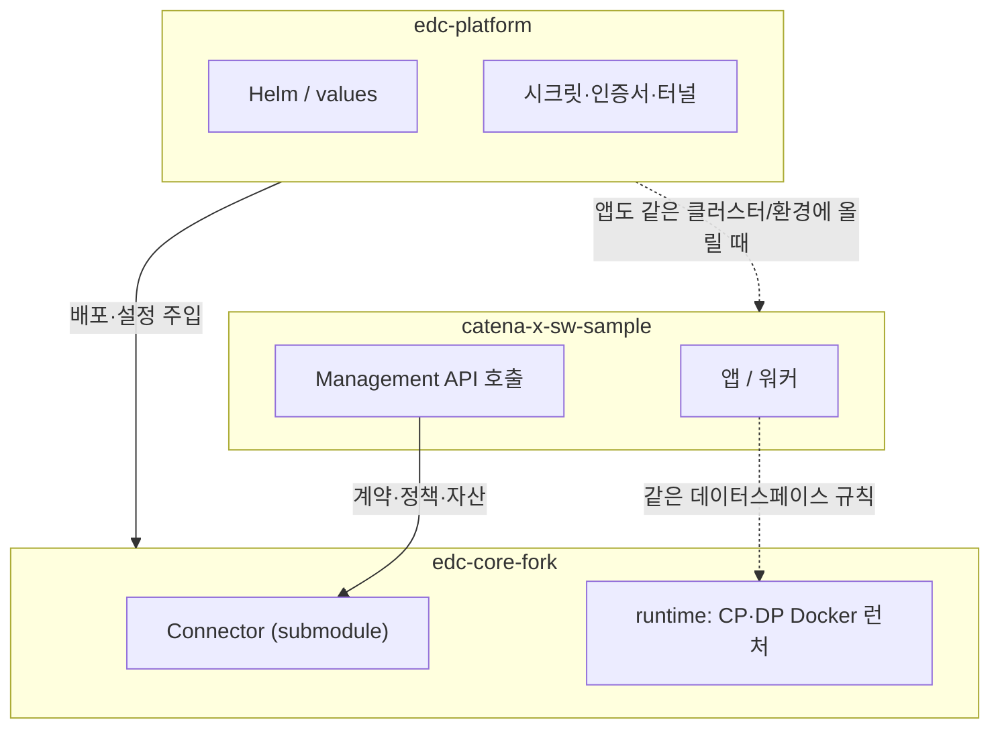
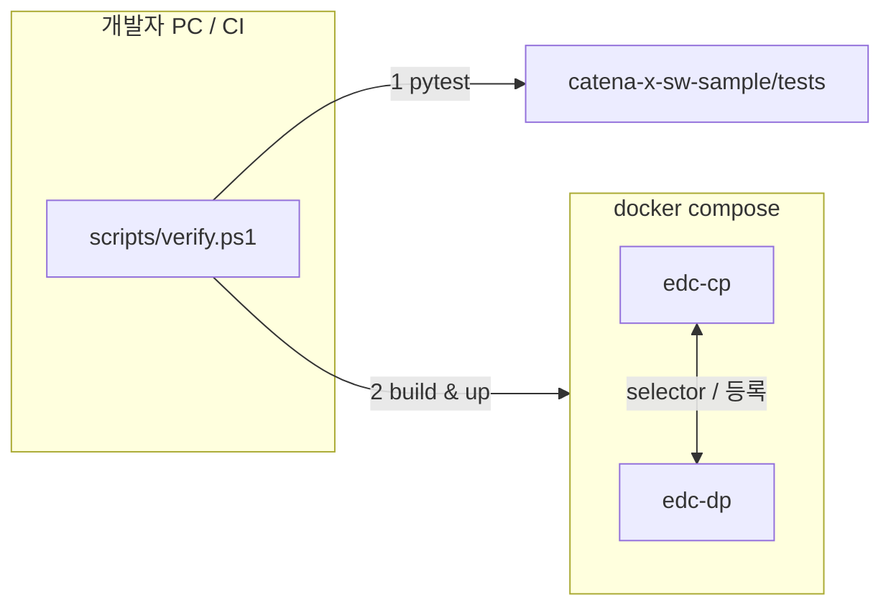

# m-x-dataspace

**데이터 스페이스(EDC 기반)** 를 **앱 · 커넥터 · 플랫폼** 세 덩어리로 나눠 책임을 분리한 모노레포입니다.  
각 폴더는 서로 다른 속도로 바뀌고, 다른 팀이 만져도 되도록 경계를 둔 것이 목적입니다.

---

## 세 폴더가 하는 일

| 폴더 | 역할 (한 줄) |
|------|----------------|
| **`catena-x-sw-sample`** | 비즈니스 앱, EDC Management 연동, Outbox/Worker, 단위·E2E 테스트의 **진입점** |
| **`edc-core-fork`** | CP/DP 런타임, 정책·프로토콜 확장. `Connector`는 **공식 EDC submodule**, `runtime/`은 **Docker로 올릴 최소 런처** |
| **`edc-platform`** | Helm values, 시크릿·인증서, 터널, 로그/메트릭 등 **운영·배포** 설정 |

---

## 폴더 간 관계 (누가 누구를 쓰나)

**읽는 법:** 앱은 주로 **커넥터(EDC)** 와 말을 주고받고, 플랫폼은 **커넥터와 앱을 같은 방식으로** 감싸 줍니다(Helm·시크릿·네트워크).

---

## 런타임에서 한 번에 보는 그림 (로컬 검증 기준)

실제 포트·환경 변수는 루트 `docker-compose.yml` 과 `edc-core-fork/runtime/README.md` 를 보면 됩니다.  
카탈로그·**계약 협상**·**데이터 전송(TransferRequest, 기본 HttpData-PUSH → COMPLETED)** 까지는 `docker compose up` 후 `python scripts/catalog_demo.py` 로 재현할 수 있습니다.

---

## 빠른 시작

1. **Python 테스트**  
   `python -m pytest catena-x-sw-sample/tests -q`

2. **EDC 컨테이너 스모크 (Windows PowerShell)**  
   `powershell -NoProfile -ExecutionPolicy Bypass -File scripts/verify.ps1`

3. **수동으로만 올리기**  
   `docker compose up --build`

4. **FastAPI 실행 (UI 연동용 백엔드)**  
   `cd catena-x-sw-sample && uvicorn app.api:app --host 0.0.0.0 --port 8000`

   - `POST /api/v1/contract` → 자산/정책/계약정의 시드 + 협상(`contractAgreementId` 반환)
   - `POST /api/v1/transfer` → `contractAgreementId`로 전송 시작 + 상태 대기
   - `POST /api/v1/assets` → 정책+자산+계약정의 시드(단계형 API)
   - `POST /api/v1/catalog` → 카탈로그 조회
   - `POST /api/v1/dataset` → 특정 자산 데이터셋(오퍼) 조회
   - `GET /api/v1/health` → 헬스체크
   - 전체 API 스모크 검증: `powershell -NoProfile -ExecutionPolicy Bypass -File scripts/verify_api.ps1`

---

## 저장소 루트에서 자주 쓰는 파일

- `docker-compose.yml` — 로컬 CP/DP 기동
- `scripts/verify.ps1` — 테스트 + Compose 빌드/기동/헬스 확인 + 정리
- `scripts/catalog_demo.py` — 시드 → 카탈로그 → 협상(`FINALIZED`) → 전송(`transferprocesses`, 기본 `COMPLETED` 대기)
- `catena-x-sw-sample/app/api.py` — `/api/v1/contract`, `/api/v1/transfer` FastAPI 엔드포인트
- `.gitmodules` — `edc-core-fork/Connector` 가 **정식 submodule** 로 연결됨

---

## 다음에 붙이기 좋은 것

- `catena-x-sw-sample`: 실제 Management URL·인증, DB-backed Outbox  
- `edc-core-fork`: 포크 브랜치 전략, 정책(ODRL) 확장 모듈  
- `edc-platform`: `values.dev/stg/prod` 분리, 실제 터널/인증서는 **Secret에만**
