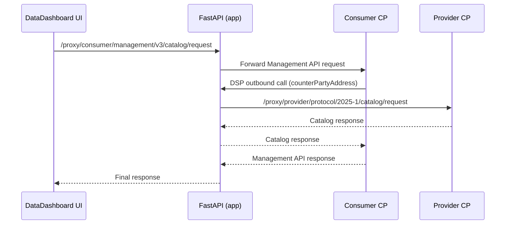

# catena-x-sw-sample

앱 계층 샘플 프로젝트입니다. 이 폴더는 로컬 EDC 스택과 연동하는
**FastAPI 백엔드 + 계약/전송 워크플로우 로직**을 제공합니다.

## 핵심 구성

- `app/api.py`
  - `GET /api/v1/health`
  - `POST /api/v1/assets`
  - `POST /api/v1/catalog`
  - `POST /api/v1/dataset`
  - `POST /api/v1/contract`
  - `POST /api/v1/transfer`
  - `/{proxy...}` 경로로 UI 요청을 EDC CP API로 프록시
- `app/edc_flow.py`
  - 자산/정책/계약정의 시드
  - Catalog 조회, 계약 협상, 전송 상태 폴링
- `Dockerfile`
  - `uvicorn app.api:app --host 0.0.0.0 --port 8000`

## 호출 흐름



## 실행

루트에서 전체 스택 실행:

```bash
docker compose --profile ui --profile app up -d --build edc-cp edc-dp provider-cp provider-dp app edc-ui
```

FastAPI만 로컬 실행:

```bash
cd catena-x-sw-sample
uvicorn app.api:app --host 0.0.0.0 --port 8000
```

## 운영 메모

- 프록시 핫스팟은 블로킹 I/O를 피해야 하며, 현재 구현은 스레드 오프로딩으로 처리합니다.
- `HttpData-PUSH` 전송 테스트 시 sink는 쓰기 endpoint (`POST`)를 사용하세요.
- `dataplanes`가 비어 있으면 UI `Assets` 화면의 `Type` 드롭다운이 표시되지 않습니다.
