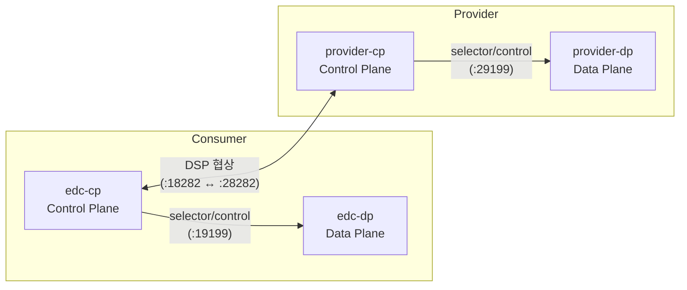

# edc-core-fork

이 폴더는 공식 EDC 기반으로 **우리 조직용 커넥터 런타임**을 구현하는 영역입니다.

→ 전체 시스템 개요: [`../README.md`](../README.md)

---

## Scope

- CP(Control Plane) / DP(Data Plane) 분리 설계
- 정책 엔진 확장 (ODRL 형태 정책 → 내부 평가 모델 매핑 포함)
- 터널/보안 요구사항에 맞는 전송 제어 포인트 추가

---

## Current state

- `Connector/` — 공식 EDC submodule (원본 소스 동기화). `.gitmodules`에 등록.
- `runtime/` — Maven Central BOM 기반 **CP/DP 최소 런처** + Dockerfiles (로컬·CI 검증용)
  - `runtime/Dockerfile.control-plane` — Consumer CP / Provider CP 공유 이미지
  - `runtime/Dockerfile.data-plane` — Consumer DP / Provider DP 공유 이미지
  - `runtime/minimal-control-plane/docker/dataspaceconnector-configuration.provider.properties` — Provider CP 설정 오버라이드
  - `runtime/minimal-data-plane/docker/dataspaceconnector-configuration.provider.properties` — Provider DP 설정 오버라이드
- 추가 확장 모듈은 `extensions/`에 관리

---

## 서비스 구성 및 포트 (docker compose 기준)

> 출처: [`../docker-compose.yml`](../docker-compose.yml)



| 역할 | Consumer 호스트 포트 | Provider 호스트 포트 |
|------|:------------------:|:------------------:|
| Management API (UI 연동) | **18181** | **28181** |
| DSP Protocol | 18282 | 28282 |
| 공개 API | 19191 | 29191 |
| Control (내부) | 19199 | 29199 |
| DP 공개 API | 19192 | 29192 |
| DP Control (내부) | 19299 | 29299 |

헬스체크: `http://127.0.0.1:19191/api/check/liveness` (CP 공개 API)

---

## Why separate from app

앱 코드와 커넥터 코드를 분리하면:

- 커넥터 업그레이드(EDC upstream sync)와 앱 릴리즈를 **독립적으로** 운영 가능
- 보안 리뷰 범위를 축소해 규제 대응을 쉽게 할 수 있음
- 정책 엔진 테스트를 커넥터 레벨에서 독립 검증 가능

---

## 빠른 시작

Docker·Compose·원클릭 검증은 루트의 파일들을 참고하세요.

```bash
# 전체 스택 (Consumer + Provider CP/DP)
docker compose up --build

# EDC 컨테이너 스모크 (Windows PowerShell)
powershell -NoProfile -ExecutionPolicy Bypass -File ../scripts/verify.ps1
```

---

## 참고 / 출처

| 항목 | 출처 |
|------|------|
| Eclipse EDC Connector | [eclipse-edc/Connector](https://github.com/eclipse-edc/Connector) |
| IDSA Dataspace Protocol (DSP) | [Dataspace Protocol Spec](https://docs.internationaldataspaces.org/ids-knowledgebase/v/dataspace-protocol) |
| EDC Maven BOM | [Maven Central `org.eclipse.edc`](https://central.sonatype.com/search?q=org.eclipse.edc) |
