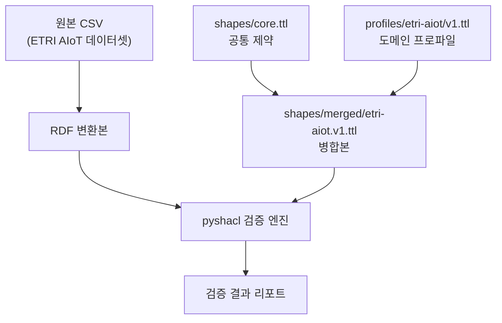
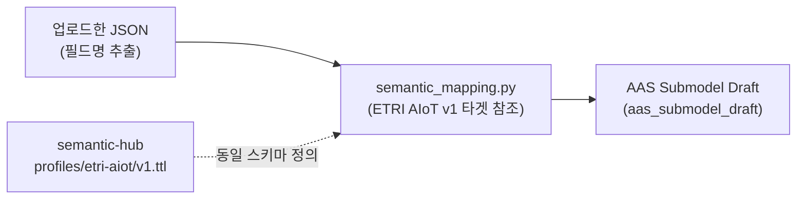

# Semantic Hub (RDF/OWL/SHACL)

시맨틱 허브 기반 데이터 정합성 검증 자산을 모아 둔 폴더입니다.

→ 전체 시스템 개요: [`../README.md`](../README.md)

---

## 핵심 구조

```
semantic-hub/
├── shapes/
│   ├── core.ttl                      # 공통 제약 (필수값, cardinality, datatype)
│   └── merged/
│       └── etri-aiot.v1.ttl          # 실행용 병합본 (core + etri-aiot profile)
├── profiles/
│   └── etri-aiot/
│       └── v1.ttl                    # ETRI AIoT 전용 프로파일 (범위, label 집합)
└── etri-aiot/
    └── run_validate.ps1              # CSV → RDF 변환 + SHACL 검증 실행
```

| 파일 | 역할 |
|------|------|
| `shapes/core.ttl` | 공통 제약: 필수값, cardinality, datatype |
| `profiles/etri-aiot/v1.ttl` | ETRI AIoT 전용 프로파일: 범위, label 허용값 |
| `shapes/merged/etri-aiot.v1.ttl` | 실행 편의를 위한 병합본 (core + profile) |
| `etri-aiot/run_validate.ps1` | CSV → RDF 변환 + SHACL 검증 실행 |

---

## 검증 구조 (2층)



- **core**: 데이터셋 공통 — 필수 필드, 카디널리티, 데이터타입
- **profile**: 도메인별 — 범위 제약, 허용 label 집합 (ETRI AIoT v1 기준)

---

## 빠른 실행

```powershell
powershell -NoProfile -ExecutionPolicy Bypass -File .\semantic-hub\etri-aiot\run_validate.ps1
```

---

## Mapping Agent 연결

`catena-x-sw-sample/app/semantic_mapping.py`는 동일한 ETRI AIoT v1 스키마 타겟을 사용합니다.

- JSON/CSV 필드명 → 10개 canonical field에 토큰 Jaccard 유사도 매핑
- 매핑 결과로 AAS 서브모델 초안(`aas_submodel_draft`) 자동 생성
- UI에서 `Assets → JSON Upload → Run Mapping Agent` 버튼으로 실행



→ FastAPI 엔드포인트: [`../catena-x-sw-sample/app/api.py`](../catena-x-sw-sample/app/api.py) — `POST /api/v1/semantic/mapping-agent`  
→ 매핑 엔진: [`../catena-x-sw-sample/app/semantic_mapping.py`](../catena-x-sw-sample/app/semantic_mapping.py)

---

## 데이터 출처

- ETRI, 산업용 AIoT(가공기계) 이상진단 데이터, 2022  
  DOI: [10.22648/ETRI.2022.D.94](https://doi.org/10.22648/ETRI.2022.D.94)

---

## 참고 / 출처

| 항목 | 출처 |
|------|------|
| W3C SHACL 명세 | [https://www.w3.org/TR/shacl/](https://www.w3.org/TR/shacl/) |
| SAMM (Semantic Aspect Meta Model) | [eclipse-esmf/esmf-sdk](https://github.com/eclipse-esmf/esmf-sdk) |
| AAS Part 2 (Submodel 구조) | [IDTA AAS Spec](https://industrialdigitaltwin.org/content-hub/aasspecifications) |
| pyshacl (Python SHACL 라이브러리) | [RDFLib/pyshacl](https://github.com/RDFLib/pyshacl) |
| rdflib | [RDFLib/rdflib](https://github.com/RDFLib/rdflib) |
